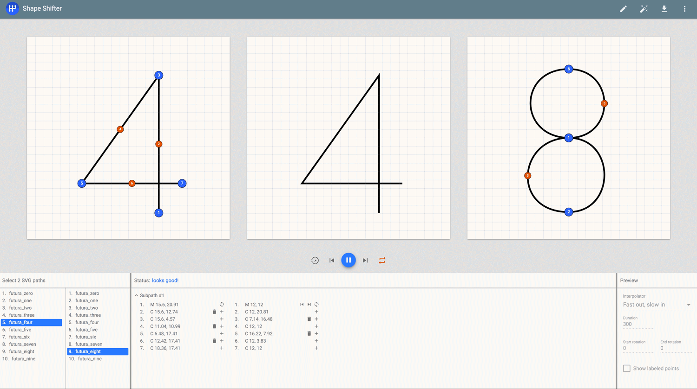

# Shape Shifter

[](https://travis-ci.org/alexjlockwood/ShapeShifter)
[](https://coveralls.io/github/alexjlockwood/ShapeShifter?branch=master)

**[Go to Live Version](https://alexjlockwood.github.io/ShapeShifter/)**

-----

[Shape Shifter](https://alexjlockwood.github.io/ShapeShifter/) is a web-app that simplifies the process of
creating SVG-based [path morphing animations][adp-path-morphing].

This tool currently exports to
[`AnimatedVectorDrawable`](https://developer.android.com/reference/android/graphics/drawable/AnimatedVectorDrawable.html)
format for Android. That said, I am totally open to adding support for other export formats as well.
File a [feature request][report-feature-request]!



## Problem

Writing high-quality [path morphing animations][adp-path-morphing]
is a tedious and time-consuming task. In order to morph one shape into another,
the SVG paths describing the two must be *compatible* with each other&mdash;that is,
they need to have the same number and type of drawing commands. This is problematic because:

* Design tools&mdash;such as [Sketch][sketch] and [Illustrator][illustrator]&mdash;do not easily
  expose the order of points in a shape, making it difficult to change their order. As a result,
  engineers will often have to spend time tweaking the raw SVG path strings given to them by
  designers before they can be morphed, which can take a significant amount of time.
* Design tools often map to shape primitives not supported in certain platforms
  (e.g. circles need to be represented by a sequence of curves and/or arcs,
  not simply by their center point and radius).
* Design tools cannot place multiple path points in the same location, a technique that
  is often necessary when making two shapes compatible with each other.
* Design tools provide no easy way to visualize the in-between states of the desired
  path morph animation.

## Features

To address these problems, Shape Shifter provides the following features:

* *The ability to add/remove points to each path without altering their original appearance.*
  The added points can be modified by dragging them to different positions along the path,
  and they can be later deleted using the keyboard as well.
* *The ability to reverse/shift the relative positions of each path's points.* While reordering points
  won't affect whether or not two paths are compatible, it often plays a huge role in determining the
  appearance of the resulting animation.
* *Shape Shifter automatically converts incompatible pairs of SVG commands into a compatible
  format.* There's no longer any need to convert `L`s into `Q`s and `A`s into `C`s by hand in
  order to make your paths compatible&mdash;Shape Shifter does this for you behind-the-scenes!
* *Shape Shifter provides a useful utility called 'auto fix', which takes two incompatible
  paths and attempts to make them compatible in an optimal way.* Depending on the complexity
  of the paths, auto fix may or may not generate a satisfying final result, so further
  modification may be necessary in order to achieve the animation you're looking for.
* *The ability to export the results to `AnimatedVectorDrawable` format for use in
  Android applications.* I'm open to adding support for other export formats as well, so
  feel free to file a [feature request][report-feature-request]!

## How does it work?

Pretty much all of the graphics in this app are powered by bezier curve approximations under-the-hood.
I learned most of what I needed to know from this excellent [primer on bezier curves][primer-on-bezier-curves]
(especially sections 9 and 33, which explain how to split and project points onto bezier
curves without altering their original appearance). Most of the interesting SVG-related code
is located under [`src/app/scripts/commands`](https://github.com/alexjlockwood/ShapeShifter/tree/master/src/app/scripts/commands).

Auto fix is powered by an adaptation of the [Needleman-Wunsch algorithm][Needleman-Wunsch],
which is used in bioinformatics to align protein or nucleotide sequences. Instead of
aligning DNA base-pairs, Shape Shifter aligns the individual SVG commands that make up
each path instead. You can view the current implementation of the algorithm in the
[`AutoAwesome.ts`](https://github.com/alexjlockwood/ShapeShifter/blob/master/src/app/scripts/commands/AutoAwesome.ts) file.

## Bug reports & feature requests

Let me know if you encounter any issues with the app (attach SVG files and/or
screenshots if you can). Before you do, take a look at the list of known issues
[here](https://github.com/alexjlockwood/ShapeShifter/issues) and leave a comment
on the existing bugs you want to see fixed in a future release!

I am open to pretty much any feature request, so don't be afraid to ask!
I'll likely work on the most popular feature requests first. **I'm especially
curious how I can make this web app more useful for iOS and web developers.**

## Build instructions

If you want to contribute, you can build and serve the web app locally as follows:

  1. First install [`Node.js`](https://nodejs.org/) and [`npm`](https://www.npmjs.com/).

  2. Install the Angular client with:

    ```
    npm install -g @angular/cli
    ```

  3. Clone the repository and in the root directory, run:

    ```
    npm install
    ```

  4. To build and serve the web app locally, run:

    ```
    ng serve
    ```

## Special thanks

Huge thanks to [Nick Butcher][nick-butcher-twitter], [Roman Nurik][roman-nurik-twitter],
and [Steph Yim][steph-yim-website] for all of their help during the early stages of this project!

  [report-feature-request]: https://github.com/alexjlockwood/ShapeShifter/issues/new
  [adp-path-morphing]: http://www.androiddesignpatterns.com/2016/11/introduction-to-icon-animation-techniques.html#morphing-paths
  [sketch]: https://www.sketchapp.com/
  [illustrator]: http://www.adobe.com/products/illustrator.html
  [Needleman-Wunsch]: https://en.wikipedia.org/wiki/Needleman%E2%80%93Wunsch_algorithm
  [primer-on-bezier-curves]: https://pomax.github.io/bezierinfo
  [nick-butcher-twitter]: https://twitter.com/crafty
  [roman-nurik-twitter]: https://twitter.com/romannurik
  [steph-yim-website]: http://stephanieyim.com
